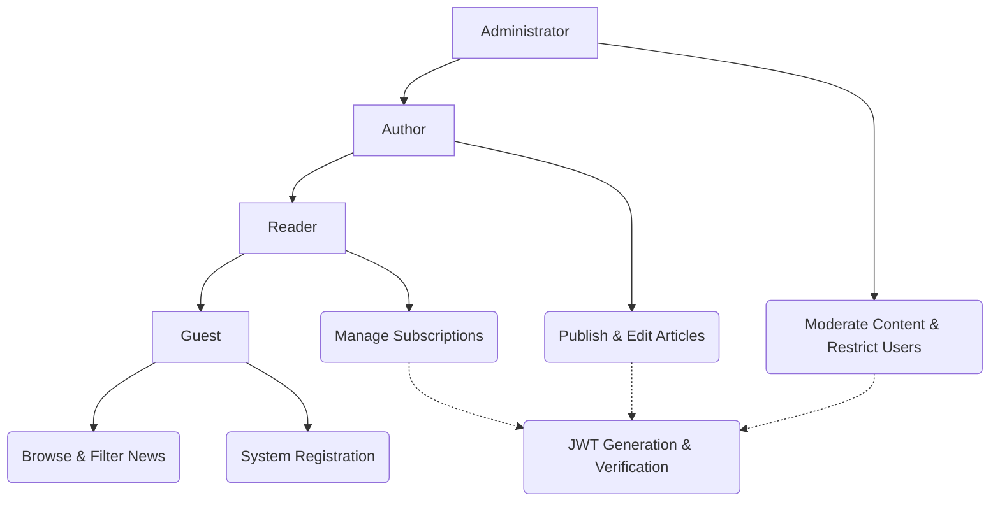
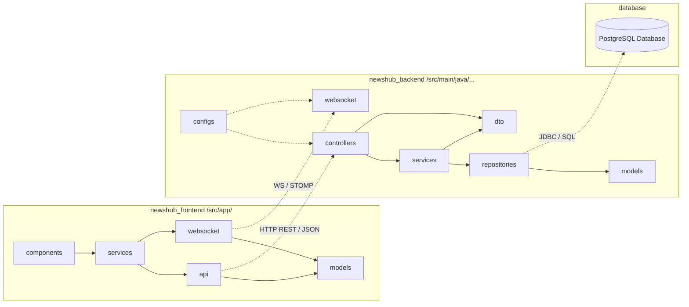
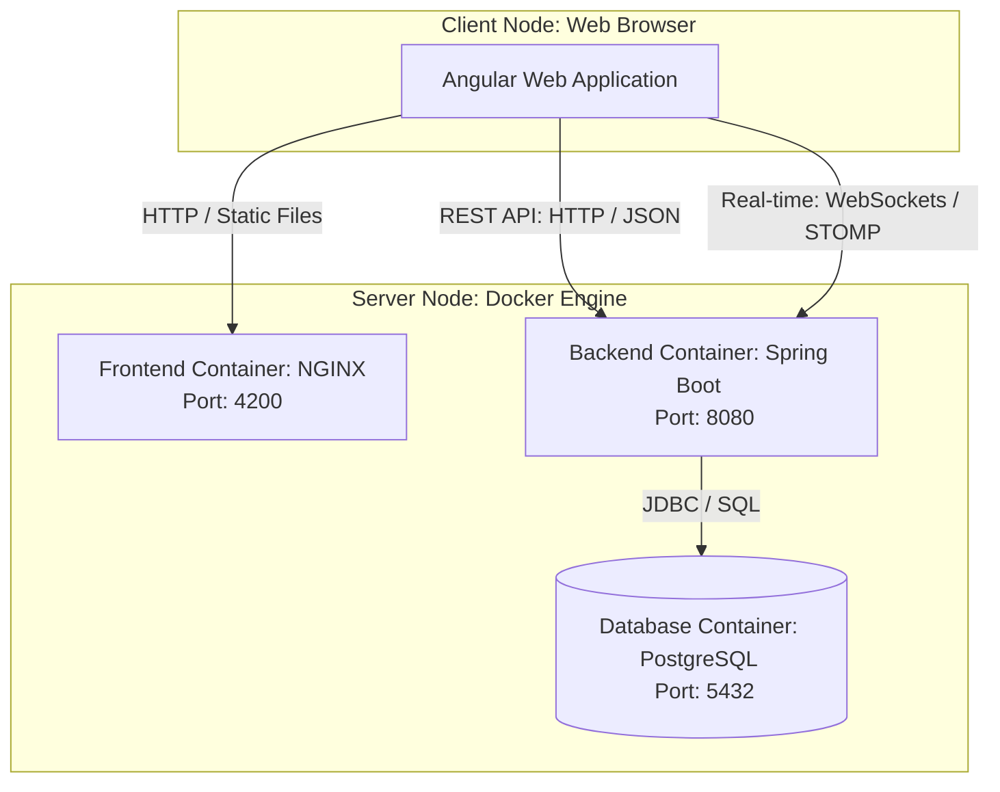
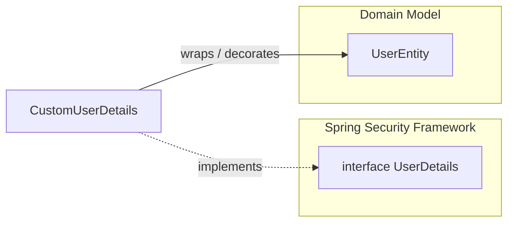
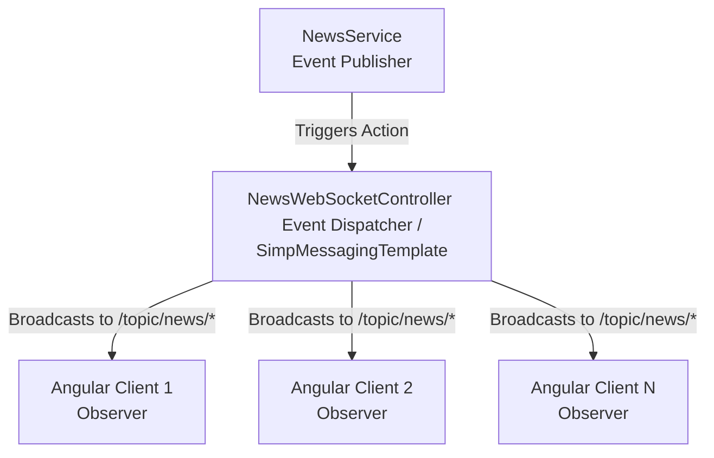

# 📰 NewsHub — Content Distribution Platform

A modern web application built on a distributed client-server architecture. It is designed for news publishing, granular role-based access control, and highly interactive user engagement via real-time event broadcasting.

## 🛠️ Production Tech Stack Specification

The system is engineered using industry-standard, enterprise-grade technologies partitioned across the application layers:
- **Backend Core:** Java 17, Spring Boot (Spring Security + JWT, Spring Data JPA, Spring Web, Spring WebSockets)
- **Frontend Core:** TypeScript, Angular Framework (RxJS, TailwindCSS, Component Architecture)
- **Data Tier:** PostgreSQL (Relational DBMS), Hibernate (ORM)
- **DevOps & Infrastructure:** Docker, Docker Compose (Container Orchestration), Multi-stage Docker Builds

---

## 📐 Architectural Modeling

### 1. Functional Model: Use Case Diagram
Illustrates system user privileges (Guest, Reader, Author, Administrator) and the mandatory extension of protected business logic use cases through the authentication service.



### 2. Structural Model: Package & Component Diagram

Demonstrates system layering, architectural design patterns (MVVM on the client side, MVC and Layered Architecture on the server side), and the use of DTOs to encapsulate database entities from external layers.



### 3. Topological Model: Deployment Diagram

Defines the physical execution environment of the deployment nodes, individual Docker containers, and the network communication protocols configured between them.



---

## 🧩 GoF (Gang of Four) Design Patterns Application

The backend infrastructure utilizes fundamental GoF design patterns to achieve low loose coupling, robust maintainability, and clear separation of concerns.

### 1. Decorator Pattern (Wrapper)

**Intent:** Attaches additional responsibilities to an object dynamically without altering its structure or relying on heavy class inheritance.

**Project Realization:** The `CustomUserDetails` class acts as a decorator for the core domain model `UserEntity`. The Spring Security framework mandates the `UserDetails` interface for managing core security abstractions (e.g., account expiration, locks). Instead of cluttering the clean `UserEntity` domain object with framework-specific infrastructure or building a fragile inheritance tree, we wrap it.

* **Execution Logic:** `CustomUserDetails` receives a `UserEntity` reference via its constructor and delegates standard calls directly to it (e.g., `getUsername()` returns `user.getLogin()`). Concurrently, it adds custom behavior on top, such as mapping internal domain roles to Spring Security's `SimpleGrantedAuthority` format with a `"ROLE_"` prefix, and mapping account lock state dynamically (`!user.isBlocked()`).



### 2. Observer Pattern (Publisher-Subscriber)

**Intent:** Defines a one-to-many dependency between objects so that when one object changes state, all its dependents are notified and updated automatically.

**Project Realization:** The event-driven WebSocket message broker infrastructure mirrors this pattern's behavior. `NewsService` operates as the **Subject (Publisher)**, while remote Angular web clients act as the **Observers (Subscribers)** listening to dedicated STOMP destination topics. The `NewsWebSocketController` behaves as the event dispatcher utilizing `SimpMessagingTemplate`.

* **Execution Logic:** When state mutations occur inside `NewsService` (`create`, `update`, `delete`), the service triggers event broadcasts by invoking the respective controller methods (such as `sendNewsCreate()`). The controller asynchronously marshals and serializes the modified payload data (`NewsPreviewDTO` or entity IDs) over active WebSocket channels like `/topic/news/created` or `/topic/news/updated`. Connected web browsers catch these events and immediately update the user UI seamlessly without page refreshes.



---

## 📂 Repository Layout & Monorepository Structure

```
NewsHub/
├── newshub_backend/          # Server-side Business Logic Layer (Spring Boot)
│   ├── src/main/java         # Java Source Packages (Controllers, Services, Repositories)
│   ├── src/main/resources    # Application Profiles & Configuration (application.yml)
│   ├── pom.xml               # Maven Dependency Management Descriptor
│   └── Dockerfile            # Multi-stage JVM Execution Build Script (JDK 17)
├── newshub_frontend/         # Client-side Presentation Layer (Angular)
│   ├── src/app               # Angular Application Shell (Components, Services, Modules)
│   ├── package.json          # Node.js Package Dependencies & Scripts Descriptor
│   └── Dockerfile            # Multi-stage SPA Web Compilation Script (NGINX Hosting)
├── compose.yaml              # Core Infrastructure Docker Compose Orchestration Setup
├── Makefile                  # Build Automation CLI Shortcuts
└── README.md                 # Technical Documentation Sheet

```

---

## 🔑 Configuration & Environment Variables (.env)

For secure, production-grade deployment across decoupled environments, a `.env` configuration file must be declared in the root repository directory prior to engine startup:

```properties
POSTGRES_DB=newshub_db
POSTGRES_USER=postgres_admin
POSTGRES_PASSWORD=secure_password_2026
JWT_SECRET=super_secret_cryptographic_key_for_newshub_application

```

---

## 🚀 Infrastructure Rapid Deployment

### Host Machine Prerequisites

* **Docker Engine** (v20.10 or newer) installed and running.
* **Docker Compose CLI Utility** (v2.0 or newer) available.

### Deployment Workflow Steps

```bash
# Step 1. Clone the repository workspace from GitHub
git clone [https://github.com/your-user/NewsHub.git](https://github.com/your-user/NewsHub.git)
cd NewsHub

# Step 2. Trigger multi-stage environment builds and assemble target Docker images
docker-compose build

# Step 3. Spin up all application network services in background detached mode
docker-compose up -d

```

---

## 📈 CI/CD Pipeline & SonarCloud Quality Metrics

Every push to the `main` branch and each Pull Request is automatically tested and analyzed in the cloud. Below are the live code quality metrics updated in real-time directly from **SonarQube Cloud**.

### ☕ NewsHub Backend Core

| Metric | Badge | Analysis Link |
| --- | --- | --- |
| **Quality Gate** | [](https://sonarcloud.io/summary/new_code?id=ArsenMonets_newshub_backend) | [Project Overview](https://sonarcloud.io/summary/new_code?id=ArsenMonets_newshub_backend) |
| **Code Coverage** | [](https://sonarcloud.io/component_measures?id=ArsenMonets_newshub_backend&metric=coverage) | [Coverage Analysis](https://sonarcloud.io/component_measures?id=ArsenMonets_newshub_backend&metric=coverage) |
| **Unit Tests Count** | [](https://sonarcloud.io/component_measures?id=ArsenMonets_newshub_backend&metric=tests) | [Test Suites](https://sonarcloud.io/component_measures?id=ArsenMonets_newshub_backend&metric=tests) |
| **Reliability (Bugs)** | [](https://sonarcloud.io/project/issues?id=ArsenMonets_newshub_backend&resolved=false&types=BUG) | [Bug Tracking List](https://sonarcloud.io/project/issues?id=ArsenMonets_newshub_backend&resolved=false&types=BUG) |
| **Maintainability (Code Smells)** | [](https://sonarcloud.io/project/issues?id=ArsenMonets_newshub_backend&resolved=false&types=CODE_SMELL) | [Code Smells Review](https://sonarcloud.io/project/issues?id=ArsenMonets_newshub_backend&resolved=false&types=CODE_SMELL) |

### 🅰️ NewsHub Frontend UI

| Metric | Badge | Analysis Link |
| --- | --- | --- |
| **Quality Gate** | [](https://sonarcloud.io/summary/new_code?id=ArsenMonets_newshub_frontend) | [Project Overview](https://sonarcloud.io/summary/new_code?id=ArsenMonets_newshub_frontend) |
| **Code Coverage** | [](https://sonarcloud.io/component_measures?id=ArsenMonets_newshub_frontend&metric=coverage) | [Coverage Analysis](https://sonarcloud.io/component_measures?id=ArsenMonets_newshub_frontend&metric=coverage) |
| **Unit Tests Count** | [](https://sonarcloud.io/component_measures?id=ArsenMonets_newshub_frontend&metric=tests) | [Test Suites](https://sonarcloud.io/component_measures?id=ArsenMonets_newshub_frontend&metric=tests) |
| **Reliability (Bugs)** | [](https://sonarcloud.io/project/issues?id=ArsenMonets_newshub_frontend&resolved=false&types=BUG) | [Bug Tracking List](https://sonarcloud.io/project/issues?id=ArsenMonets_newshub_frontend&resolved=false&types=BUG) |
| **Maintainability (Code Smells)** | [](https://sonarcloud.io/project/issues?id=ArsenMonets_newshub_frontend&resolved=false&types=CODE_SMELL) | [Code Smells Review](https://sonarcloud.io/project/issues?id=ArsenMonets_newshub_frontend&resolved=false&types=CODE_SMELL) |

> ℹ️ Clicking on any badge or link redirects you directly to the corresponding section of the project dashboard on SonarCloud for deep-dive log investigation and code line tracing.

### Active Networking Access Points

* **Client App Application Hub (Angular + NGINX UI Gateway):** [http://localhost:4200](https://www.google.com/search?q=http://localhost:4200)
* **Core Engine Server Layer (Spring Boot REST Server):** [http://localhost:8080](https://www.google.com/search?q=http://localhost:8080)
* **Relational Storage Core Instance (PostgreSQL Engine):** `localhost:5432`

---

## 🛑 Service Lifecycles, Teardown & Purging

```bash
# Shut down the operational stack safely while preserving persistent data volumes
docker-compose down

# Shut down the operational stack completely and wipe database structures (drop volumes)
docker-compose down -v

# Hard system purge: remove containers, shared networks, and all cached project images
docker-compose down -v --rmi all --remove-orphans

```

---

## 🛠️ Task Automation Shortcuts via `make`

An integrated `Makefile` is bundled in the workspace root to streamline daily local development operations via brief commands:

```bash
make up       # Rapidly provision, assemble, and launch stack infrastructure
make logs     # Attach to and stream stdout log feeds from all executing containers
make down     # Gracefully terminate operational server layers
make restart  # Fast cycle restart of all infrastructure engine modules
make clean    # Hard clean system environment of Docker residues left by the project

```

