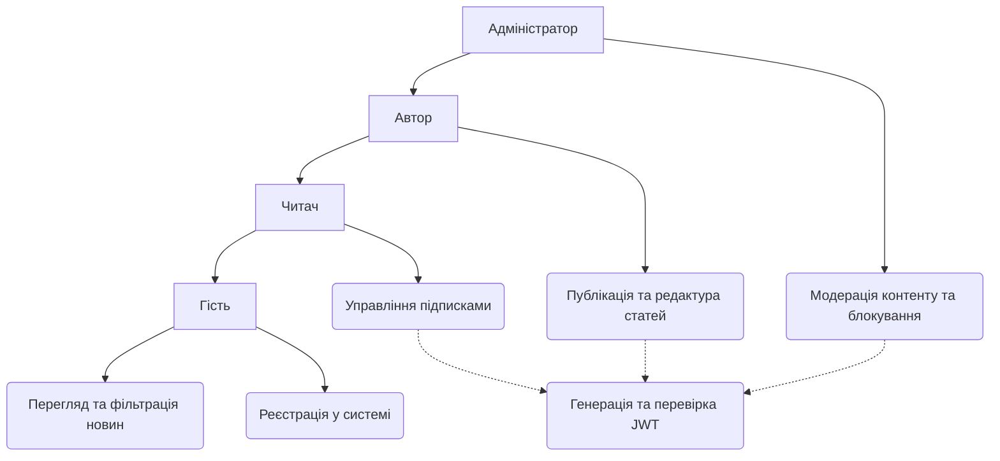
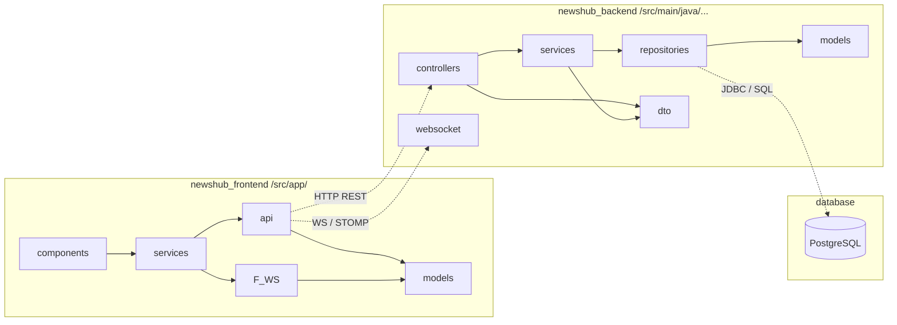
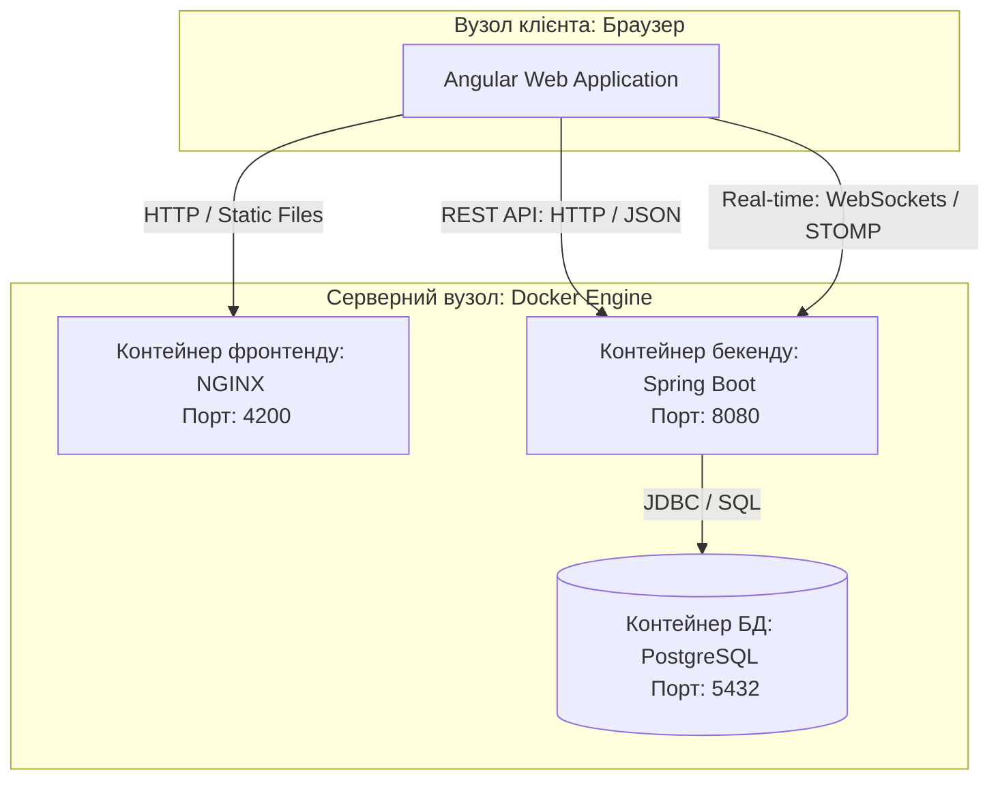

# 📰 NewsHub — Платформа дистрибуції контенту

Сучасна вебплатформа, що побудована за архітектурним шаблоном розподіленого клієнт-серверного застосунку, призначена для публікації новин, гнучкого керування рольовим доступом користувачів та забезпечення інтерактивної взаємодії за допомогою трансляції подій у реальному часі.

---

## 👤 Інформація про автора

- **Виконавець:** Монець А.В.
- **Академічна група:** ФеП-32
- **Науковий керівник:** Жишкович А.В., асистент
- **Дата захисту / виконання:** 29.05.2026

---

## 🛠️ Специфікація технологічного стека

Проєкт реалізовано на базі виробничих технологій промислового рівня, які згруповано за компонентами системи:
- **Backend Core:** Java 17, Spring Boot (Spring Security + JWT, Spring Data JPA, Spring Web, Spring WebSockets)
- **Frontend Core:** TypeScript, Angular Framework (RxJS, TailwindCSS, Сomponent Architecture)
- **Data Tier:** PostgreSQL (Реляційна СКБД), Hibernate (ORM)
- **DevOps & Infrastructure:** Docker, Docker Compose (Оркестрація контейнерів), Multi-stage Docker Builds

---

## 📐 Архітектурне моделювання проекту

### 1. Функціональна модель: Діаграма прецедентів (Use Case Diagram)
Відображає права доступу користувачів (Гість, Читач, Автор, Адміністратор) та логіку обов'язкового розширення бізнес-прецедентів через сервіс автентифікації.



### 2. Структурна модель: Діаграма пакетів та патернів (Package Diagram)

Демонструє розшарування системи, застосування архітектурних патернів MVVM (на клієнті), MVC та Layered Architecture (на сервері), а також використання DTO для ізоляції сутностей бази даних.



### 3. Топологічна модель: Діаграма розгортання (Deployment Diagram)

Описує фізичне середовище виконання проєкту та мережеві порти взаємодії між ізольованими Docker-контейнерами.



---

## 📂 Структурна організація монорепозиторію

```
NewsHub/
├── newshub_backend/          # Модуль серверної бізнес-логіки (Spring Boot)
│   ├── src/main/java         # Вихідний код компонентів (Controller, Service, Repository)
│   ├── src/main/resources    # Конфігураційні файли (application.yml)
│   ├── pom.xml               # Декларація залежностей збірки Maven
│   └── Dockerfile            # Інструкція багатоетапної збірки (JDK 17)
├── newshub_frontend/         # Модуль клієнтського інтерфейсу (Angular)
│   ├── src/app               # Модулі, компоненти та сервіси застосунку
│   ├── package.json          # Конфігурація npm-пакетів та скриптів збірки
│   └── Dockerfile            # Скрипт компіляції та розгортання под NGINX
├── compose.yaml              # Головний файл оркестрації Docker Compose
├── Makefile                  # Набір CLI-аліасів для розробника
└── README.md                 # Технічна документація системи

```

---

## 🔑 Безпека та змінні оточення (.env)

Для безпечного розгортання системи в колі проєкту перед запуском створюється файл `.env` із наступними ключовими параметрами конфігурації:

```properties
POSTGRES_DB=newshub_db
POSTGRES_USER=postgres_admin
POSTGRES_PASSWORD=secure_password_2026
JWT_SECRET=super_secret_cryptographic_key_for_newshub_application

```

---

## 🚀 Швидкий запуск інфраструктури

### Системні вимоги до хост-машини

* Наявність встановленого демона **Docker** (v20.10 або новіша)
* Інструмент утиліти **Docker Compose** (v2.0 або новіша)

### Алгоритм розгортання

```bash
# Крок 1. Клонування репозиторію проекту з GitHub
git clone [https://github.com/your-user/NewsHub.git](https://github.com/your-user/NewsHub.git)
cd NewsHub

# Крок 2. Компіляція вихідного коду та побудова Docker-образів
docker-compose build

# Крок 3. Запуск усіх сервісів в ізольованому фоновому режимі (detached)
docker-compose up -d

```

### Мережеві адреси для перевірки працездатності

* **Клієнтський UI (Angular + NGINX):** http://localhost:4200
* **Серверний API (Spring Boot REST):** http://localhost:8080
* **Системна база даних (PostgreSQL):** `localhost:5432`

---

## 🛑 Сервісні команди зупинки та очищення

```bash
# Зупинка роботи застосунку зі збереженням стану бази даних
docker-compose down

# Зупинка системи із повним видаленням баз даних (очищення томиків)
docker-compose down -v

# Комплексне видалення контейнерів, застарілих мереж та локальних образів
docker-compose down -v --rmi all --remove-orphans

```

---

## 🛠️ Використання автоматизації через `make`

Утиліта `make` дозволяє欴 оптимізувати повсякденну роботу за допомогою вбудованих інструкцій з Makefile:

```bash
make up       # Швидке розгортання та запуск інфраструктури
make logs     # Безперервний вивід логів (stdout) усіх контейнерів у консоль
make down     # Безпечне вимкнення серверного стеку
make restart  # Швидкий перезапуск усіх модулів платформи
make clean    # Повне системне очищення Docker від слідів проекту

```
