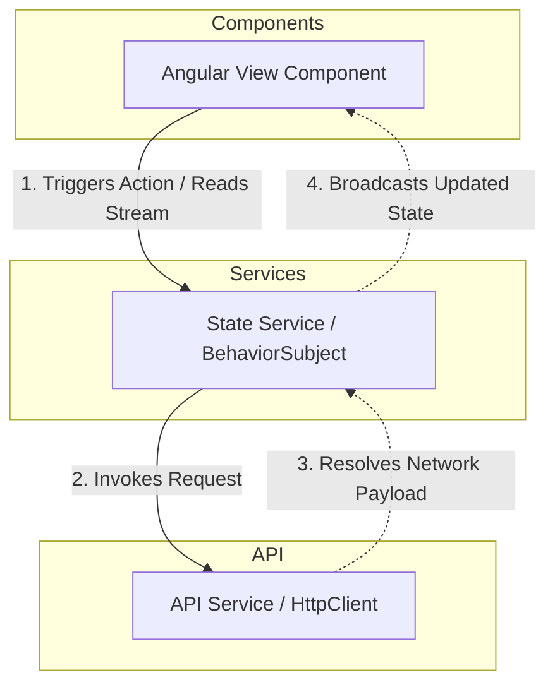

# Frontend Architecture Specification — Angular Client

## 1. Architectural Overview
The frontend layer of **NewsHub** is designed as a Single Page Application (SPA) utilizing **Angular**, **TypeScript**, and **TailwindCSS**. The system is engineered around a **Reactive, Feature-Based Architecture** focused on strict separation of concerns, high render performance, and robust type safety.

### Core Architectural Principles:
* **Standalone Architecture:** Minimizes module overhead by using Angular Standalone Components, Directives, and Pipes.
* **Unidirectional Data Flow:** Data strictly flows down via property bindings (`@Input()`), and events bubble up via event bindings (`@Output()`).
* **Reactive Programming:** Heavily relies on **RxJS** streams for managing asynchronous operations, HTTP communication, and real-time WebSocket state mutations.

---

## 2. Directory & Package Structure
The client application codebase within `src/app/` is partitioned into modular layers to isolate HTTP networking, business logic, components, and global helpers.


```

src/app/
├── api/                      # Data Access Layer (HTTP Clients)
│   ├── auth.api.ts           # Authentication API requests (Login, Register)
│   ├── news.api.ts           # News CRUD and filtering HTTP services
│   └── comment.api.ts        # Comments handling HTTP services
├── services/                 # Business Logic & Component State Layer
│   ├── auth-state.service.ts # Core security state management and token handling
│   ├── news-state.service.ts # Reactive storage for active news feeds and filters
│   └── websocket.service.ts  # STOMP / WebSocket event stream orchestration
├── components/               # Presentation Layer (UI Views)
│   ├── auth/                 # Login and Registration views
│   ├── news-feed/            # Main news list and filtering layout
│   ├── news-detail/          # Single article viewer with real-time comments
│   └── shared/               # Global reusable UI (Buttons, Modals, Spinners)
├── interceptors/             # HTTP Middleware Layer
│   └── auth.interceptor.ts   # JWT injection and global HTTP error handling
├── models/                   # Type Safety Layer
│   ├── user.model.ts         # User-centric TypeScript interfaces
│   └── news.model.ts         # News and comment data contracts
├── app.component.ts          # Root Application Shell Component
├── app.config.ts             # Global Application Bootstrapping Configurations
└── app.routes.ts             # Top-Level Lazy-Loaded Routing Registry

```

---

## 3. Component & State Interaction Pattern

To ensure clear isolation of concerns, components rely on dedicated services to manage state, while the data access layer remains strictly segregated inside the `api/` folder.

### 3.1. Components (Presentation Layer)
* **Responsibilities:** * Render the user interface and handle local view states.
  * Delegate business logic execution and state reading to classes inside `services/`.
* **Data Flow:** Extract view data using the `async` pipe from public streams exposed by state services, avoiding manual data management inside component code.

### 3.2. Services (Business Logic & State Providers)
* **Responsibilities:**
  * Act as intermediate controllers that hold reactive data stores using **`BehaviorSubject`**.
  * Call raw HTTP request methods from the `api/` layer, process outputs, and pipe them directly into state streams.
* **Component Optimization:** Enable components to maintain clean lifecycles by removing heavy async operations from the presentation layer.



---

## 4. Reactive State Management & Data Flow

The architecture mandates strict avoidance of local state corruption and manual subscription leaks.

### 4.1. RxJS Pipeline Architecture

* **Declarative Streams:** Data pipelines must remain declarative. Manual `.subscribe()` invocations inside services or components are prohibited for standard rendering pipelines.
* **Template Consumption:** All UI bindings must consume streams natively inside templates via the **`async` pipe** (`*ngIf="news$ | async as news"`), letting Angular handle setup and teardown lifecycles naturally.

### 4.2. State Store Realization

Application states are orchestrated using lightweight, service-based state containers. State variables are backed by private `BehaviorSubject` instances inside the `services/` layer, revealing mutations cleanly downstream as read-only Observables:

```typescript
// Sample State Management Architecture Pattern
@Injectable({ providedIn: 'root' })
export class NewsStateService {
  private readonly _news$ = new BehaviorSubject<NewsPreview[]>([]);
  public readonly news$ = this._news$.asObservable();

  constructor(private newsApi: NewsApi) {}

  public loadAllNews(): void {
    this.newsApi.getAll().subscribe(data => this._news$.next(data));
  }

  public appendArticle(article: NewsPreview): void {
    const current = this._news$.getValue();
    this._news$.next([article, ...current]);
  }
}

```

---

## 5. Development & Deployment Commands

Execute execution scripts through the `npm` task manager runner from within the `newshub_frontend/` repository route:

### Install System Dependencies

```bash
npm install

```

### Spin up Local Development Server

```bash
npm run start

```

*Note: Application binds natively to operational address: `http://localhost:4200*`

### Compile Production Static Assets

```bash
npm run build -- --configuration=production

```

### Containerize Client Layer

```bash
docker build -t newshub-frontend:latest .

```

---

## 6. Architectural Guardrails (Gotchas)

* **No `any` Keyword Allowances:** Strict compilation parameters are locked. Every API response schema, parameter object, and event payload must map to a strong TypeScript `interface` or explicit `type` in the `models/` directory.
* **Memory Leak Elimination:** When manual sub-routines require `.subscribe()` implementations within script classes, always bound lifecycles to preventing leaks by calling **`takeUntilDestroyed()`** inside the injection context or tracking references inside `ngOnDestroy`.
* **Strict Layer Separation:** Components must **never** inject HTTP services from the `api/` directory directly. All interactions with network resources must pass through the logical orchestration boundary inside the `services/` folder.